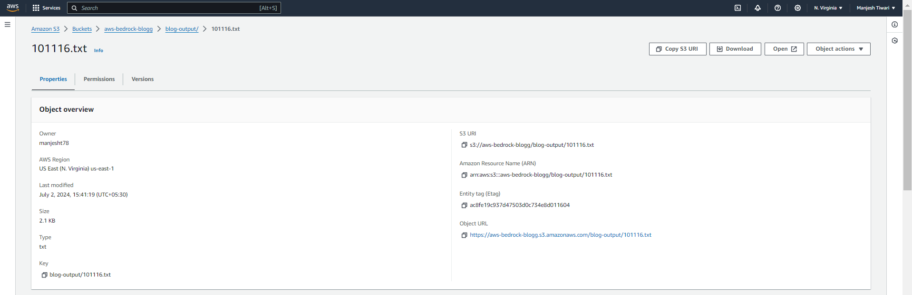

Blog Generator using AWS Bedrock and Lambda

Overview

This project leverages AWS Bedrock and Lambda to generate blog posts based on a given topic. The project consists of:

- A Lambda function that invokes the Bedrock API to generate the blog post
- An HTTP API (API Gateway) that exposes a REST endpoint to receive requests

Architecture

- AWS Lambda Function 
- AWS Bedrock API
- HTTP API 
- Postman (for testing)

Steps

Step 1: Create and Configure Lambda Function

1. Create a Lambda function and deploy the code from (link unavailable).
2. Increase the runtime of the Lambda function from the default 3 seconds to several minutes.
3. Attach the Administrator policy to the role.
4. Add a new layer to the Lambda function for boto3 by running the following command in your terminal:

```bash
pip install boto3 -t python/
```

This will install the boto3 library and save it in the python/ directory.
1. Upload the boto3 library as a new layer to the Lambda function.

Step 2: Create and Deploy HTTP API Gateway

1. Create an HTTP API gateway.
2. Create a new POST API route.
3. Create a new stage and deploy it.

Step 3: Test with Postman

1. Use the URL shown in the stage and the name of the gateway in the Postman application.
2. Provide the topic in the request body.
3. Send the request to generate the blog post.


Outputs:




You're done!

Thanks for reading.
